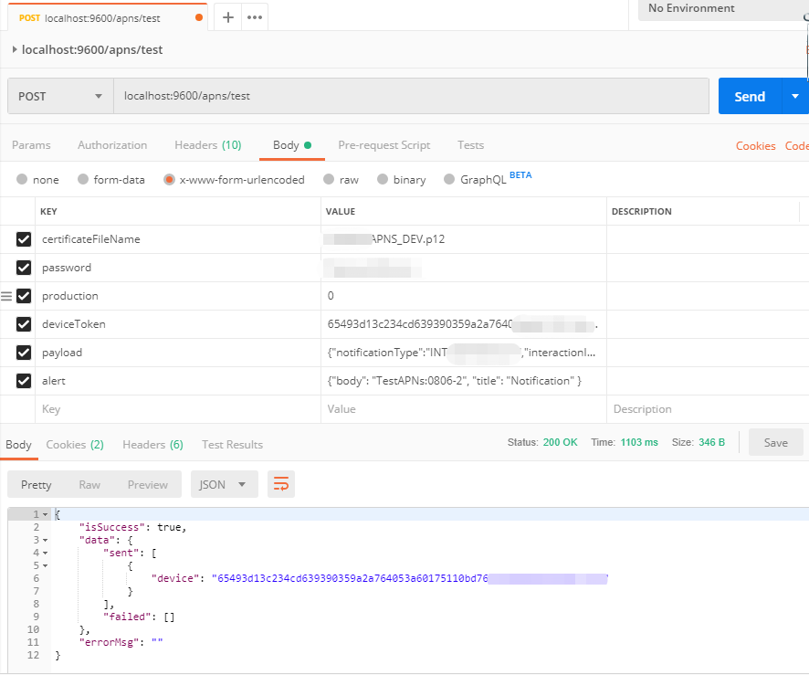

# TestAPNs

A simple local server to testing the APNs send notification to your device

## How to use

### install

```
npm install
```

```
npm run start
```

### config your certificate(.p12 files)

```
mkdir certificate
```

copy your certificate file to certificate folder

### use Postman or other tool send post request



localhost:9600/apns/test

POST: x-www-form-urlencoded

```
certificateFileName:XXXX_APNS_DEV.p12
password:certificate password
production:0
deviceToken:519a130836d6bf8952b3969b366ab78de477c380989ed612220f0be033c590fc
payload:{"notificationType":"INT_XXXXX","interactionId":[5326000]}
alert:{"body": "TestAPNs:1", "title": "TestAPNs" }
```
